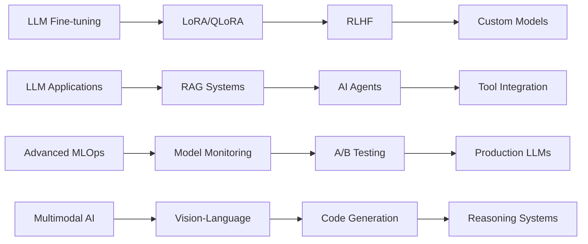

# Abdul Nazeer M 
### Machine Learning Engineer | AI Researcher | Data Science Enthusiast

<div align="center">
  
[](https://git.io/typing-svg)

</div>

---


## 🎯 About Me

```python
class MLEngineer:
    def __init__(self):
        self.name = "Abdul Nazeer M"
        self.role = "Machine Learning Engineer"
        self.location = "India 🇮🇳"
        self.languages = ["Python", "SQL", "JavaScript"]
        self.specializations = [
            "Deep Learning", "NLP", "Computer Vision",
            "Generative AI", "LLM Fine-tuning", "MLOps", 
            "LLM-powered Applications", "Data Engineering"
        ]
        self.current_focus = "Fine-tuning LLMs & building intelligent applications"
    
    def get_daily_routine(self):
        return {
            "morning": "☕ Coffee + Research papers",
            "afternoon": "💻 Model training & optimization",
            "evening": "📊 Data analysis & visualization",
            "night": "🧠 Learning new AI frameworks"
        }
```

<br clear="right"/>

##  What I'm Working On

- 🎯 **LLM Fine-tuning** - Custom domain-specific language models using LoRA, QLoRA & PEFT
- 🤖 **LLM-powered Applications** - Building intelligent chatbots, code assistants & RAG systems
- � **Advancied NLP Models** - Context-aware conversational AI with memory & reasoning
- ⚡ **MLOps Pipeline** - Automated model deployment, A/B testing & monitoring
- 📊 **Real-time Analytics** - Streaming data processing with ML insights
- 🧠 **Research Projects** - Exploring efficient fine-tuning techniques & model optimization

## 💡 Core Expertise

<table>
<tr>
<td width="50%">

### 🤖 Machine Learning & AI
- **LLM Fine-tuning**: LoRA, QLoRA, PEFT, Full Fine-tuning, RLHF
- **LLM Applications**: RAG, Agents, Tool Use, Chain-of-Thought
- **Deep Learning**: Neural Networks, CNNs, RNNs, Transformers
- **NLP**: BERT, GPT, T5, LLaMA, Mistral, Claude Integration
- **Generative AI**: Text Generation, Code Generation, Multimodal AI

</td>
<td width="50%">

### 🛠️ Engineering & Tools
- **LLM Frameworks**: LangChain, LlamaIndex, Transformers, Unsloth
- **Fine-tuning Tools**: LoRA, QLoRA, PEFT, DeepSpeed, Accelerate
- **Vector Databases**: Pinecone, Weaviate, ChromaDB, FAISS
- **MLOps**: MLflow, Weights & Biases, Kubeflow, Docker, Kubernetes
- **Cloud**: AWS SageMaker, Google Cloud AI, Azure OpenAI Service

</td>
</tr>
</table>

## 🚀 Tech Stack

<div align="center">

### Languages & Core


### ML/AI Frameworks


### LLM & Fine-tuning


### Data & Analytics


### Cloud & DevOps


### Databases & Vector Stores


</div>

## 📊 GitHub Analytics

<div align="center">
<table>
<tr>
<td width="50%">


</td>
<td width="50%">


</td>
</tr>
</table>


</div>

## 🏆 Achievements & Certifications

<div align="center">


</div>

## 📈 Contribution Graph

<div align="center">


</div>

## 🎯 Current Learning Path



## 🧠 LLM Expertise Showcase

<div align="center">

| Fine-tuning Techniques | LLM Applications | Optimization Methods |
|:---------------------:|:----------------:|:-------------------:|
| 🎯 **LoRA & QLoRA** | 🤖 **Chatbots & Assistants** | ⚡ **Quantization** |
| 🔧 **PEFT Methods** | 📚 **RAG Systems** | 🚀 **Model Compression** |
| 🎓 **RLHF Training** | 🛠️ **Tool-using Agents** | 💾 **Memory Optimization** |
| 📊 **Custom Datasets** | 💬 **Conversational AI** | 🔄 **Efficient Inference** |

</div>

## 🤝 Let's Connect & Collaborate

<div align="center">

[](https://www.linkedin.com/in/abdul-nazeer-m-ba4111253)
[](mailto:roxnazeer@gmail.com)
[](https://github.com/abdul-nazeer)
[](#)

</div>

---

<div align="center">


**"Building the future, one algorithm at a time"** 🚀


</div>
